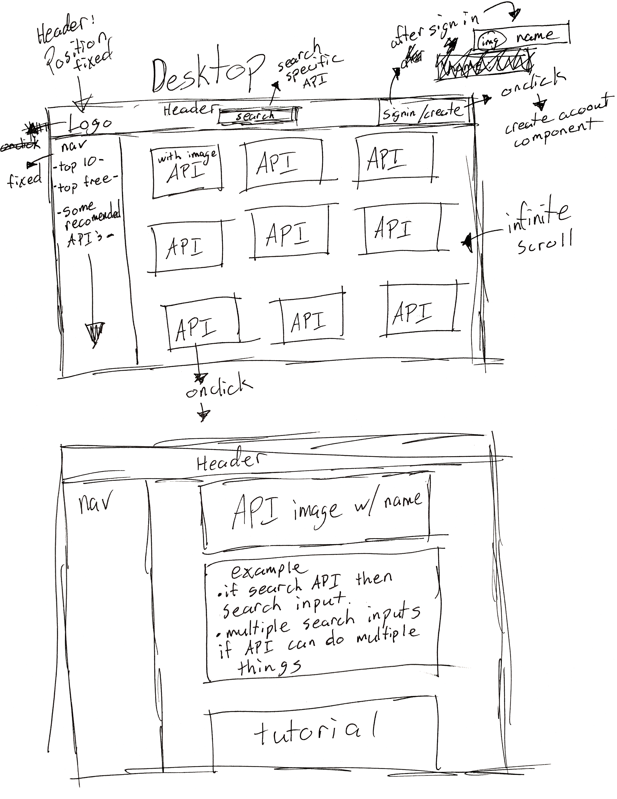
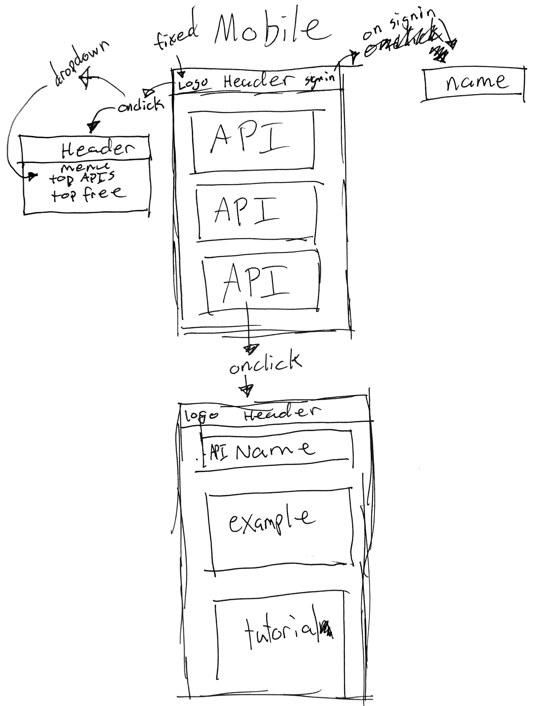

# _APEyes_

#### _This is a web application where users can test out multiple api's, 3/29/19_

#### By _**Ryan McLean**_

## Description

_This webpage is designed for anyone who is interested in using any api and wants to test it out before incorporating it into their own project._

## Setup/Installation Requirements

* _Open your terminal or command prompt and input `cd desktop` then `git clone https://github.com/Lilkgb/APEyes` to install the files onto your desktop._
* _Once downloaded, in terminal type in `cd apeyes` and it will take you into the correct file._
* _Run `npm install` to get all needed dependencies_
* _Run `npm run start` to bring up a live version of the website through your local host_
* _Create a repository for yourself on github or what application you may use_
* _Copy url link thats given and run `git remote add -Your initials- -Link-` inside your terminal_
* _Push your project when ready with `git push -Your initials- -Branch name (master is default)-`_

## Time Management

_on 5/3/19_
* _8am: clone down my personal react template which can be found here https://github.com/Lilkgb/new-react-template ._
* _9am: research what kind of api's are out and available._
* _10am: start drawing a mock up of what I want my website to look like._
* _11am: continue on drawing a mock up for desktop._
* _11:30am: finish desktop mockup. start mobile mockup._
* _12pm: lunch_
* _1pm: continue on mock up mobile._
* _1:30pm: finish mobile mock up._
* _2pm: add mobile mockup and desktop mockup to readme._
* _3pm: push files to repo._
* _3:30pm - 4:30pm decide what apis I want to use for my mvp and add to readme_

## Research / Mockups

## WireFrames

_None at the time_

## MVP
_[] custom logo_

_[] clean ui interface_

_[] 3-4 api's with examples_

_[X] firebase authentication_

_[X] firebase storage_

_API's_

_[] better doctor_

_[] Hearthstone_

_[X] Giphy_
## Known Bugs

_as of 5/3/19 - none_

## Support and contact details

_Please contact Ryan McLean at rmcleandev@gmail.com_

## Technologies Used

* _Webpack_
* _Bootstrap_
* _React_
* _Firebase_

### License

*This Software is Licensed under the MIT License.*

Copyright (c) 2019 **_Ryan McLean_**
